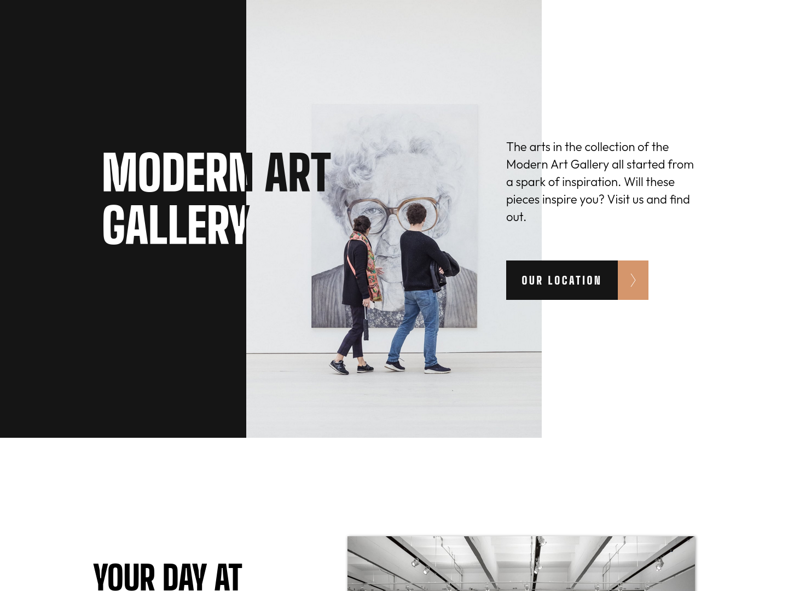

# Frontend Mentor - Art gallery website solution

This is a solution to the [Art gallery website challenge on Frontend Mentor](https://www.frontendmentor.io/challenges/art-gallery-website-yVdrZlxyA). Frontend Mentor challenges help you improve your coding skills by building realistic projects. 

## Table of contents

- [Overview](#overview)
  - [The challenge](#the-challenge)
  - [Screenshot](#screenshot)
  - [Links](#links)
- [My process](#my-process)
  - [Built with](#built-with)
  - [What I learned](#what-i-learned)
  - [Continued development](#continued-development)
  - [Useful resources](#useful-resources)
- [Author](#author)
- [Acknowledgments](#acknowledgments)

## Overview

### The challenge

Users should be able to:

- View the optimal layout for each page depending on their device's screen size
- See hover states for all interactive elements throughout the site
- Use [Leaflet JS](https://leafletjs.com/) to create an interactive location map with custom location pin

### Screenshot



### Links

- Solution URL: [Modern Art](https://modern-art.vercel.app/)
- Live Site URL: [Github Repository](https://github.com/xtirian/Frontend-Mentor-SnyderCut/tree/main/art-gallery-website)

## My process

### Built with

- Semantic HTML5 markup
- CSS custom properties
- Flexbox
- CSS Grid
- [Sass-lang](https://sass-lang.com/) - CSS preprocessor
- Mobile-first workflow
- [React](https://reactjs.org/) - JS library
- [Vite.js](https://vitejs.dev/) - ViteJs framework
- [React Router](https://reactrouter.com/en/main) - For navigation
- [React Icons](https://react-icons.github.io/react-icons/icons?name=bi) - For Icons
- [Leaflet](https://leafletjs.com/index.html) - For the interactable map
- [Leaflet Providers](https://github.com/leaflet-extras/leaflet-providers) - Custom layers for Leaflet

### What I learned

1- **Google fonts in React**

For this project I could import the fonts from google using the @import. it was pretty ease. The unique code I needed was the:

```css

  @import url("https://fonts.googleapis.com/css2?family=Big+Shoulders+Display:wght@900&family=Outfit:wght@300&display=swap");

```

2 - **Passing the children component in ReactJS**

As this is my second project that I make with the Vite.JS using this workflow, with the React-Dom, the Sass, I took care to make it slow and enjoy the process, trying to look at every part of the code , and exploring every possibility.

```jsx
const ButtonR = ({children}) => {
  return (
    <div>
      <Link to={`/location`}>{children}</Link>
    </div>
  )
}
```

3- **Passing theme with props**

Since I was off of the React since mar/23, because I started study React-Native, I tried to set the theme for a component using props. In mar/23 I used kinda of the same logic to change the the dark theme to light with a button. Here I didn't want to put a button, but as the component is the same change just the theme, so I thought I could use the logic in a different way to reach the same propose.

``` jsx
const Footer = (props) => {

  //here I save in memory the theme (isn't necessary since I could get it directly)
  let theme = props.theme;

  //Here I set the src for each logo I would use
  let logoDark = "/images/logo-dark.svg";
  let logoLight = "/images/logo-light.svg";

  //And here I check what logo will display on the screen
  let currentLogo = theme == "dark" ? logoLight : logoDark;

  return (
    <div
      style={{
        backgroundColor: theme == "dark" ? "#151515" : "#d5966c",
        color: theme == "dark" ? "#fff" : "#151515",
      }} //Here I make a simple check to define the main colors for the container. I know that I could delete this and make a check only for the class name, but I calculated and I came to the conclusion that I would use less lines of code doing this here, then create a class for each theme with the differences being only these colors, like I did after in the Icons
      className="footer_container"
    >
      <footer>
        

        <p className="footer-content">
          The Modern Art Gallery is free to all visitors and open seven days a
          week from 8am to 9pm. Find us at America Avenue, RJ, BR.
        </p>

        <nav>
          <ul>
            <li>
              <a href="https://www.linkedin.com/in/mf-cunha/" target="_blank" title="All the links here are from author's social media">
                <FaLinkedin className={theme == 'dark'? "iconDark": "iconLight"} size={20} />
              </a>
            </li>
            <li>
            <a href="https://www.frontendmentor.io/profile/xtirian" target="_blank">
              <SiFrontendmentor className={theme == 'dark'? "iconDark": "iconLight"} size={20} />
              </a>
            </li>
            <li>
            <a href="https://github.com/xtirian" target="_blank">
              <FaGithub className={theme == 'dark'? "iconDark": "iconLight"} size={20} />
              </a>
            </li>
            <li>
              <a href="https://codepen.io/xtirian" target="_blank">
                <FaCodepen className={theme == 'dark'? "iconDark": "iconLight"} size={20} />
              </a>
            </li>
          </ul>
        </nav>
      </footer>
    </div>
  );
};
```

4-  **Using LeafLet to create a interactable map**

This was a very interesting part of the project. It was very difficult to get good information of how to do it in React, since all documentation are talking about doing it in javascript. But the documentation WAS helpful. Even if I didnt knew how to make it work in  React, I knew what to do, So when I found the video of Alejandro AO teaching how to do, was so simple. The final code was that:

```jsx
import "leaflet/dist/leaflet.css"; // A important thing. The first import from your component that uses map should be the Leaflet CSS, ath least before the others

const Map = () => {
  //Here I defined the first position. This position will be the center of the map
  const position = [-22.9975, -43.3577];

  // in markers I create a list of locations I wanted to mark in the map. To take that I just get some random points next to the position
  const markers = [
    { geocode: [-22.9975, -43.3577], popUp: "Barra Shopping" },
    { geocode: [-22.9983000, -43.3659000], popUp: "Cidade das Artes" },
    { geocode: [-22.9957,-43.3727], popUp: "Parque Natural Minucipal Bosque da Barra" },
    { geocode: [-23.0059,-43.3632], popUp: "Lagoa Marapendi" },
  ];

  //Here is how I set a custom Icon. This gave me trouble and made me delete all the component and start again couple of times. For some reason I didn't find out, most of the tutorials, people use the require() function to set the icon URL, but here didn't work, so I strugled to get it done in this part
  const customIcon = new Icon({
    iconUrl: mapIcon, //icon url
    iconSize: [50, 70], //size of the icon
  });

  return (
    
    <MapContainer center={position} zoom={15}> {/*here i use the main position*/}
    {/*here I put some contribution. This is a good practice in this case, so don't take it off*/}
      <TileLayer
        attribution='&copy; <a href="https://www.openstreetmap.org/copyright">OpenStreetMap</a> contributors'
        url="https://tile.openstreetmap.org/{z}/{x}/{y}.png"
      />
      {/*This is a custom layer that change the map and icons. For me, make it more beauty. 
      To get that you should go and google for Leaflet providers, so you go to the git*/}
      <TileLayer      
      url="https://{s}.basemaps.cartocdn.com/rastertiles/voyager_labels_under/{z}/{x}/{y}{r}.png"
      attribution='&copy; <a href="https://www.openstreetmap.org/copyright">OpenStreetMap</a> contributors &copy; <a href="https://carto.com/attributions">CARTO</a>' />


      {/*This is a component that assemble the markers when you zoom out.*/}
      <MarkerClusterGroup>
       {/* This function is just to get all the markers and put on the map using the geocode and the popUp information*/}
        {markers.map((marker) => (
          <Marker position={marker.geocode} icon={customIcon}>
            <Popup>
              <h2>{marker.popUp}</h2>
            </Popup>
          </Marker>
        ))}
      </MarkerClusterGroup>
    </MapContainer>
  );
};
```

5- **Background-clip and Text linear gradient**

The first moment I searched for what is the best way to do the effect in the home banner. I thought that could exist a magical css property that make my font negative considering the background, but this didn't came to me. So I had to find a way to get that by my self.

I found this function in the internet:
```css
.pattern-desktop{
      background: -webkit-linear-gradient( #fff, #151515);
      background-clip: text;
      -webkit-background-clip: text;
      -webkit-text-fill-color: transparent;
    }  
```
So I just have to adapt for what I need. But this works only with the webkit and I don't know how much it could affect my code in a negative way, but I'm trying.

### Continued development

I think I shoul take more harder challenges to test myself. Despite adaptation with Vite.Js, I think it was pretty easy to handle.

Another thing I should take care is about the time I spend coding and improve my skill to plan what I'm doing in a project

### Useful resources

- LeafLet Tytorial from [Alejandro AO - Software & Ai](https://www.youtube.com/watch?v=jD6813wGdBA) Youtube Channel. really complete and worth.

## Author

- Linkedin - [Click here](https://www.linkedin.com/in/mf-cunha/)
- GitHub - [Click here](https://github.com/xtirian/)
- FrontEnd Mentor - [Click here](https://www.frontendmentor.io/profile/xtirian)
- CodePen - [Click Here](https://codepen.io/xtirian/)
