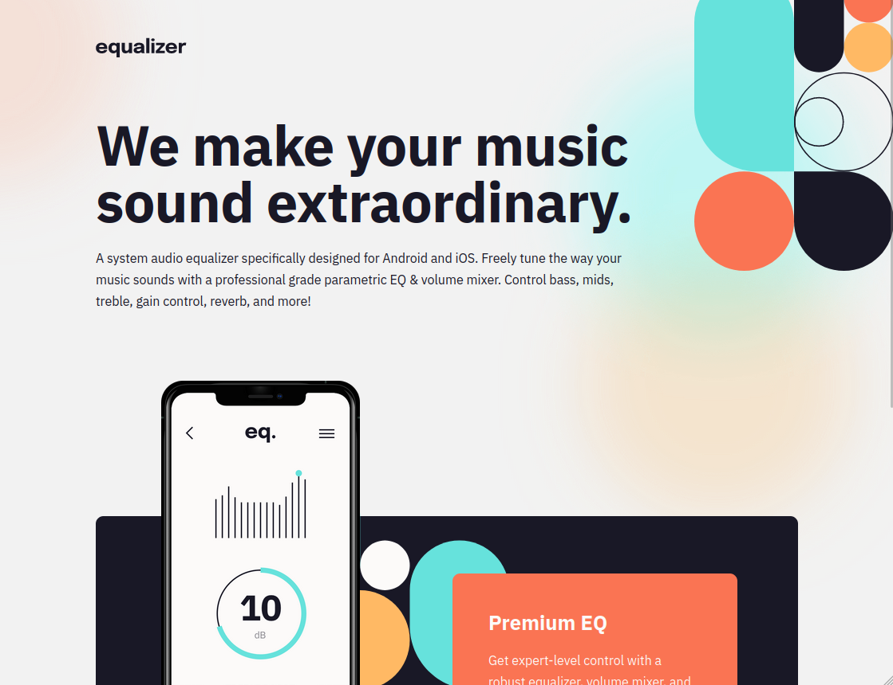

# Frontend Mentor - Equalizer landing page

This is a solution to the [Equalizer landing page on Frontend Mentor](https://www.frontendmentor.io/challenges/equalizer-landing-page-7VJ4gp3DE). Frontend Mentor challenges help you improve your coding skills by building realistic projects. 

## Table of contents

- [Overview](#overview)
- [Screenshot](#screenshot)
- [Links](#links)
- [My process](#my-process)
- [Built with](#built-with)
- [What I learned](#what-i-learned)
- [Continued development](#continued-development)
- [Useful resources](#useful-resources)
- [Author](#author)
- [Acknowledgments](#acknowledgments)

## Overview

### Screenshot

### Links

- Solution URL: [Git Repository](https://github.com/xtirian/Frontend-Mentor-SnyderCut/tree/main/equalizer-landing-page)
- Live Site URL: [Frontend Mentor - Equalizer landing page](https://equalizer-lp-xtirian.vercel.app)

## My process

### Built with
- Semantic HTML5 markup
- CSS custom properties
- SASS Pre-processor
- Flexbox
- CSS Grid
- Mobile-first workflow

### What I learned

In this project I didn't applied anything new, just pratcied the same things form the others challenges

## Author
- Linkedin - [Clique aqui](https://www.linkedin.com/in/mf-cunha/x)
- GitHub - [Clique aqui](https://github.com/xtirian/)