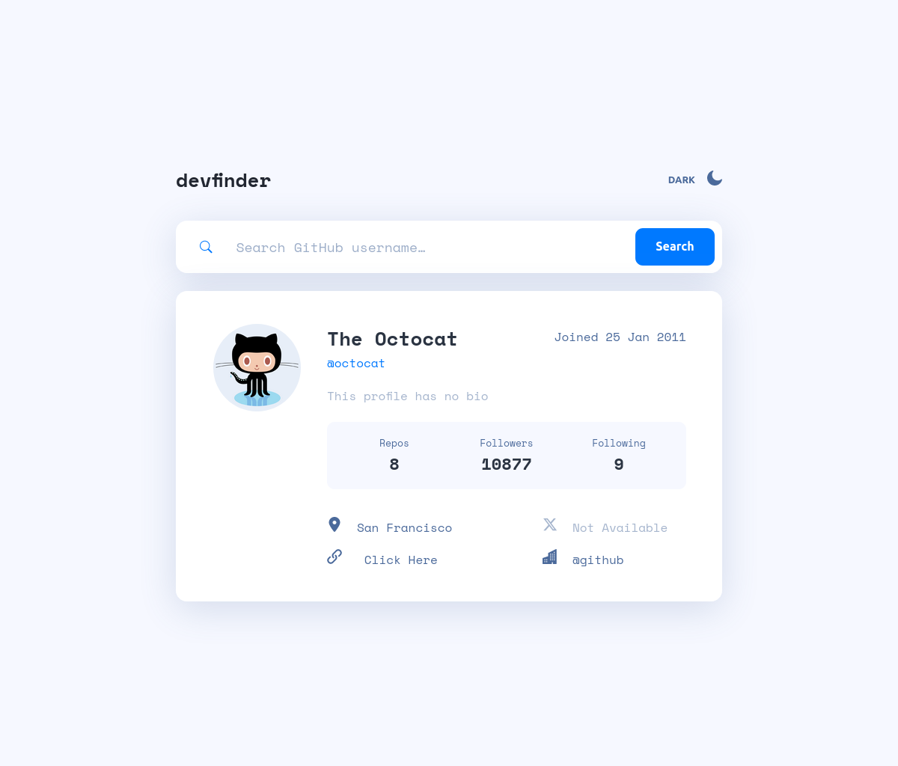

# Frontend Mentor - Github User Search

This is a solution to the [Github User Search challenge on Frontend Mentor](https://www.frontendmentor.io/challenges/github-user-search-app-Q09YOgaH6). Frontend Mentor challenges help you improve your coding skills by building realistic projects. 

## Table of contents

- [Overview](#overview)
- [Screenshot](#screenshot)
- [Links](#links)
- [My process](#my-process)
- [Built with](#built-with)
- [What I learned](#what-i-learned)
- [Continued development](#continued-development)
- [Useful resources](#useful-resources)
- [Author](#author)

## Overview

### Screenshot



### Links

- Solution URL: [Add solution URL here](https://github.com/xtirian/Frontend-Mentor-SnyderCut/tree/main/github-user-search)
- Live Site URL: [Add live site URL here](https://github-user-search-pi-fawn.vercel.app/)

## My process

### Built with

- Semantic HTML5 markup
- CSS custom properties
- Flexbox
- CSS Grid
- [Sass-lang](https://sass-lang.com/) - CSS preprocessor
- Mobile-first workflow
- [React](https://reactjs.org/) - JS library
- [Vite.js](https://vitejs.dev/) - ViteJs framework
- [React Icons](https://react-icons.github.io/react-icons/icons?name=bi) - For Icons
- [Github API](https://docs.github.com/en/rest) - For users search

### What I learned

1 **API Fetch**

Since my first touch with API fetch, I got hard time. Except when I worked with Angular, because Angular has a pretty easy way to handle APIs. So, to improve my skills in this area, I decided to make the fetch using it as a "service". I create the "handleAPI.js" to serve the main application. I had two problems in that:
- The first one was that I couldn't find a way to return the promise correctly for my application. My problem was the Promise return that I couldn't handle. So a friend told me that when I'm recieving a async function, the receptor must be an async too. Then I got this result that a called in the form:

```javascript
{async (e) => {
  e.preventDefault();
  const userResult = await handleAPI.handleFetch(userInput);
  setUserInfo(userResult);
  }
}
```

### Continued development

For some reason I couldn't use the prefer-theme-scheme. I tried, but didn't worked. I should come back and redo the theme scheme

### Useful resources

- [JSON API](https://jsonapi.org/) - This helped me to test my service and methods in application before start using the GitHub API.

## Author

- Website - [xTirian](https://xtirian-portfolio.vercel.app/)
- Frontend Mentor - [@yourusername](https://www.frontendmentor.io/profile/xtirian)
- Linkedin - [Matheus F Cunha](https://www.linkedin.com/in/mf-cunha/)


