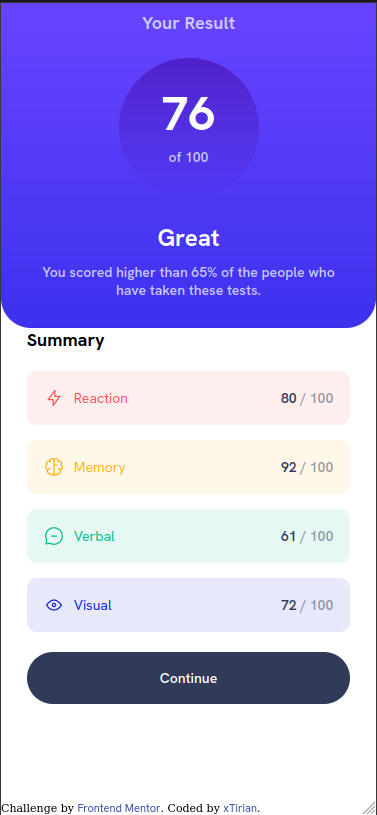
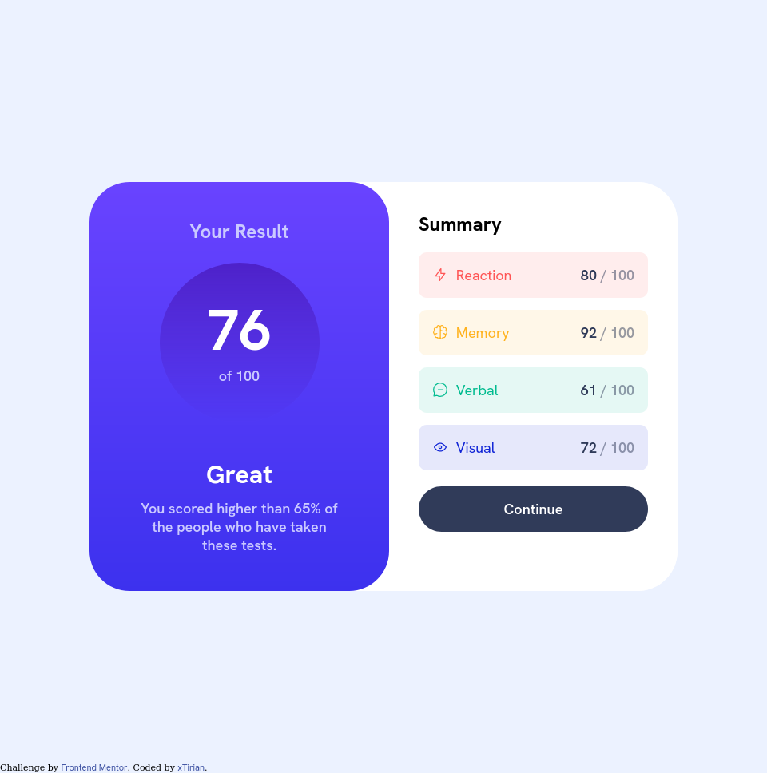

# Frontend Mentor - Results summary component


## Table of contents

- [Overview](#overview)
- [Screenshot](#screenshot)
- [Links](#links)
- [My process](#my-process)
- [Built with](#built-with)
- [What I learned](#what-i-learned)
- [Continued development](#continued-development)
- [Author](#author)

## Overview

It was easy compared to the lastone, but I took 6 hours in this project. 4 hours was just studying how to fetch data from json and trying ways to use that data inside the HTML. Was a good test and I'm glad this was just a component, because I could make up for the time I wasted studying JS. The mainly content that I used for understand how works the Fetch was from these Youtube Channels [dcode](https://youtu.be/5VCY9yCZnlc) and [The coding train](https://youtu.be/uxf0--uiX0I).

### Screenshot

Mobile


Web


### Links

- Solution URL: [Go to Repository](https://github.com/xtirian/Frontend-Mentor-SnyderCut/tree/main/results-summary-component-main)
- Live Site URL: [Go to site](https://sumary-component.vercel.app/)

## My process

### Built with

- Semantic HTML5 markup
- CSS custom properties
- Flexbox
- Mobile-first workflow
- Javascript (data fetch and manipulating of an external JSON file)

### What I learned

In this project I had opportunity to learn  how to fetch datas from json from an different file. I made some notations for future works:

```js
fetch("./data.json").then(function (response){
 // The fetch is used to get acess to the JSON data
// And when the API or in that case the JSON file give te acess to the data (thats why use the property then), he execute a function and have the response as first argument
// The response has useful methods, as like being text or being JSON
// I this example i'll use JSON method on the response object to "convert" the json on actually javascript Object
// So here I'll:
 return response.json();

 //So here this will try to interpret the json data and convert it in Javascript object, and return a new promise
}).then(function (obj){
 //Here I already had the actual objects and could print it in the console:
 console.log(obj)
 //This returned an array with the objects writed in data.json

 // now I'm gonna put an valve in case of error using catch:
}).catch(function (error) {
 console.error("Something went wrong with retrieving the data!");
 console.error(error)

 // This valve will return the error to the console if there is any problem in the 
});
```

If you notice, despite I made this notation, I applied it in a different way. The most time I was working in this project, I was looking for the screen trying to figure how use the data, because the content I studied dont give the logic that I have to use, just the commands at the JS. My main difficult was how to use the data, because the commands were there, I fetch and then I take the response and use (Other thing that I didn't use was the command JSON.parse to convert the data in a actual data inside the JS, but by the limit of my knowledge I couldn't make it work) so I had to do the way I did. 

### Continued development

The organization of the code was easy today, part because I'm understandig more the dynamic of creating with the mobile-first workflow and part because was an small componen.

## Author

- Portifólio - [Clique aqui](https://xtirian.netlify.app/)
- Linkedin - [Clique aqui](https://www.linkedin.com/in/mf-cunha/x)
- GitHub - [Clique aqui](https://github.com/xtirian/)


