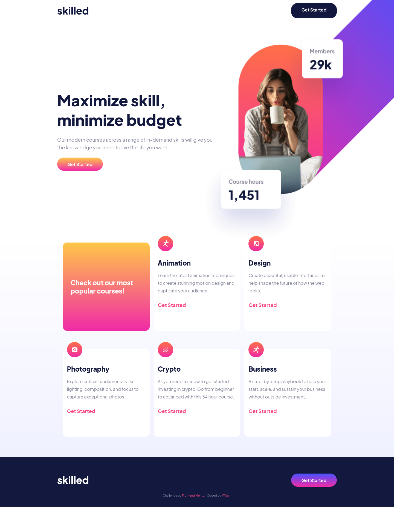

# Frontend Mentor - Skilled e-Learning

This is a solution to the [Skilled e-learning landing page challenge on Frontend Mentor](https://www.frontendmentor.io/challenges/skilled-elearning-landing-page-S1ObDrZ8q).

## Table of contents

- [Overview](#overview)
  - [Screenshot](#screenshot)
  - [Links](#links)
- [My process](#my-process)
  - [Built with](#built-with)
  - [What I learned](#what-i-learned)
  - [Continued development](#continued-development)
- [Author](#author)

## Overview

In this project I'll gonna continue my development with the mobile-first workflow and give a try to SASS with the content of the Youtube Channel [Matheus Battisti - Hora de Codar](https://www.youtube.com/@MatheusBattisti).

### Screenshot

Web (the others screenhots you can see inseide ./assets/results)


### Links

- Solution URL: [Go to Repository](https://github.com/xtirian/Frontend-Mentor-SnyderCut/tree/main/skilled-elearning-landing-page)
- Live Site URL: [Go to Site](https://skilled-elearning-kappa.vercel.app)

## My process

### Built with

- SASS
  -Semantic HTML5 markup
- CSS custom properties
- Flexbox
- CSS Grid
- Mobile-first workflow

### What I learned

The first thing was how to setting it up to work. I read that I need to create a folder to create the SASS files. So I created the sass folder with the style.sass and gave the command in TERMINAL :

```terminal
$ sass --watch sass/style.sass:css/styles.css
```

With this command, the SASS will create a CSS folder linked with the content I write in SASS after the preprocess.

Then, the second thing is the the partials. I can create a partial that is a file with a part of the code. This is a way to modularize the CSS by context. For that I first create a file with " \_variables.sass". must have the underline before the name

To create a variable is easy, just need to put the name of the variable after $

```sass
$primary-color: #13183F
$secondary-color: #F74780
$tertiary-color: #FFFFFF
```

Other important thing I learned is the nesting concept in SASS, taht is a form to organize by context. The nesting gives especifity without the need to repeat tags classes and ids

The last thing I'm taking notes about this project is the part of mixins. It was so more easy and reasonable to create mixins to use later in the code, like I did with the font-sizes and the media queries

```sass
@mixin bodyS
 font-size: 16px
 line-height: 28px
 font-weight: 700

@mixin bodyM
 font-size: 18px
 line-height: 28px

@mixin desktop
 @media (min-width: 1100px)
  @content

```

In a brief review I could say that it's good use SASS. I'd already use Bootstrap but I hated it. With bootstrap I don't feel that I was creating the website, just copy and paste. With SASS you keep working and doing the style code with the nails, but with some improvements, and thats what I loved. Just fit with me. I'm about to buy a shirt with "SASSy boy" in front haha.

### Continued development

I'll keep trying to improve my skills and organization of the code. Seeing videos of others persos coding was helping me to learning new features, like this SASS that I just saw today's morning and decided to apply.

## Author

- Portifólio - [Clique aqui](https://xtirian.netlify.app/)
- Linkedin - [Clique aqui](https://www.linkedin.com/in/mf-cunha/x)
- GitHub - [Clique aqui](https://github.com/xtirian/)
